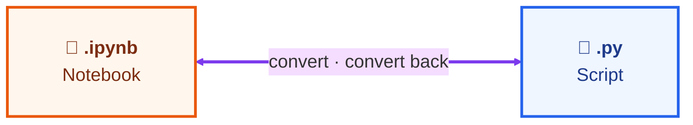

  

 

> 🚧 **Still in the ideation phase.**

# How it works

```mermaid
%%{init: {"theme":"base","themeVariables":{"fontFamily":"Inter, ui-sans-serif, system-ui","fontSize":"20px","lineColor":"#7c3aed"},"flowchart":{"nodeSpacing":100,"rankSpacing":160,"padding":30,"curve":"basis"}}}%%
flowchart LR
    A["📓 <b>.ipynb</b><br/>Notebook"]
    B["🐍 <b>.py</b><br/>Script"]

    A <==>|"convert · convert back"| B

    classDef nb fill:#fff7ed,stroke:#ea580c,stroke-width:3px,color:#7c2d12
    classDef py fill:#eff6ff,stroke:#2563eb,stroke-width:3px,color:#1e3a8a
    class A nb
    class B py
```

 
