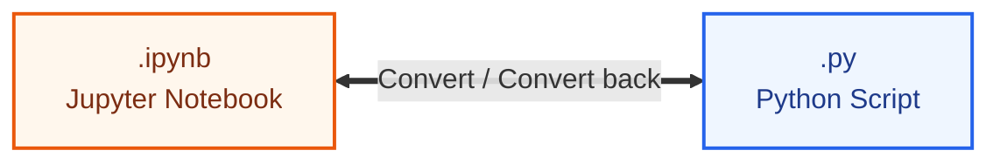

  

 

> [!IMPORTANT]
> This project is currently in the ideation phase.

# How it works

```mermaid
flowchart LR
    A[".ipynb<br/>Jupyter Notebook"]
    B[".py<br/>Python Script"]

    A <==>|Convert / Convert back| B

    classDef nb fill:#fff7ed,stroke:#ea580c,stroke-width:2px,color:#7c2d12
    classDef py fill:#eff6ff,stroke:#2563eb,stroke-width:2px,color:#1e3a8a
    class A nb
    class B py
```

 
